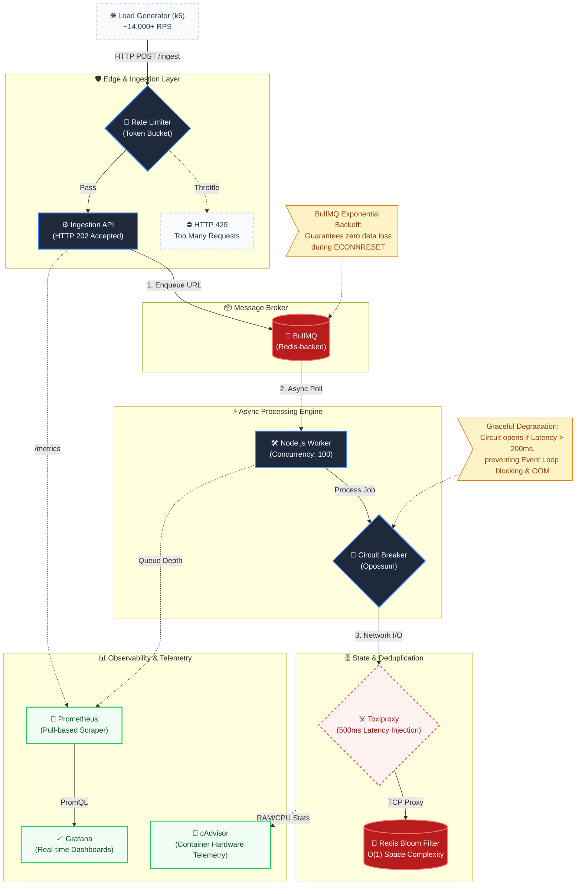

# 🌐 DevSearch: Distributed Web Crawler Ingestion Engine

A production-grade, highly concurrent web crawler ingestion pipeline engineered for scale.

Built to solve real distributed systems bottlenecks including Node.js event loop saturation, infinite crawl loops, OOM (Out-Of-Memory) crashes, and catastrophic network partition failures.

---

## 🚀 Tech Stack

**Backend:** Node.js, Express

**Queue & Storage:** BullMQ, Redis, RedisBloom

**Resilience:** Opossum, Toxiproxy

**Observability:** Prometheus, Grafana

**Performance Testing:** k6

---

# 🚀 Engineering Journey

This system was deliberately engineered to handle massive throughput without relying on managed cloud services. Every architectural decision was driven by load-test metrics, ensuring maximum resource efficiency, mathematically bounded memory usage, and fail-fast resilience.

| Bottleneck | Engineering Solution |
|------------|---------------------|
| Infinite Loops & Memory Exhaustion | Redis Bloom Filter for O(1) URL deduplication (~12KB per 10k URLs) |
| Event Loop Saturation | BullMQ Worker Concurrency = 100, achieving 14,000+ RPS |
| Cascading Database Failures | Opossum Circuit Breakers protecting Redis operations |
| Thundering Herd Problem | Exponential Backoff with delayed job retries |

---

# 🏗️ System Architecture



---

# 🔬 Core Engineering Challenges & Solutions

## 1. Performance Engineering: Solving the I/O Bottleneck

### Problem

During load testing with 500 concurrent virtual users, the Express API handled traffic successfully, but background workers collapsed under load. Sequential job processing created an ever-growing queue backlog.

### Solution

The workload was identified as highly network I/O-bound.

By increasing BullMQ worker concurrency to **100**, Node.js could efficiently multiplex network requests while the operating system managed waiting sockets.

### Results

| Metric | Before | After |
|----------|---------|---------|
| API Throughput | 16,056 req/sec | 14,248 req/sec |
| Max API Latency | 1.72s | 1.73s |
| Queue Backlog | 501,457 Waiting Jobs | 0 Waiting Jobs |

### Impact

The ingestion API and workers now fairly share the Node.js event loop while maintaining stable throughput and near-instant queue draining.

---

## 2. Resilience Engineering: Designing for Failure

### Problem

Distributed systems fail.

Database latency spikes can block workers, causing memory exhaustion and OOM crashes. Network interruptions can lead to dropped jobs and permanent data loss.

### Solution

Chaos engineering was integrated into the development lifecycle.

### Circuit Breaker (Opossum)

Redis operations are wrapped in circuit breakers.

If latency exceeds **200ms**, the circuit opens and immediately rejects requests, protecting memory and preventing event-loop congestion.

### Exponential Backoff (BullMQ)

Failed jobs are automatically parked in delayed queues and retried later, preventing retry storms and eliminating manual intervention.

### Results

| Scenario | Before | After |
|-----------|---------|---------|
| Redis latency spikes to 500ms | Event loop blocked → OOM crash | Circuit opens → Graceful degradation |
| TCP connection severed | Data lost permanently | Job delayed and automatically retried |
| Traffic flood | Queue overflow | HTTP 429 via Token Bucket |

---

# 🧠 Key Engineering Decisions

Distributed systems often trade perfect accuracy for scalability and reliability.

| Decision | Rationale |
|-----------|------------|
| Redis Bloom Filter vs Hash Map | O(1) memory growth with bounded RAM consumption |
| Priority Queue vs FIFO | Process high-value URLs before low-value content |
| Separate Ingestion & Processing | HTTP 202 response creates natural backpressure |

### Bloom Filter Trade-Off

To support billions of URLs without requiring hundreds of gigabytes of memory, the system accepts a ~1% false-positive rate in exchange for mathematically guaranteed memory stability.

---

# 📈 Observability

The platform was built with an observability-first mindset.

### Prometheus Metrics

- API Throughput
- Request Latency
- Queue Depth
- Worker Throughput
- Redis Health
- Circuit Breaker State

### Grafana Dashboards

- Real-time ingestion rates
- Queue backlog monitoring
- Failure rates
- Infrastructure health
- Circuit breaker activity

---

# ☠️ Chaos Engineering

The platform continuously validates resilience through controlled failures using Toxiproxy.

### Latency Injection Test

```bash
./latency-runbook.sh
```

Injects 500ms latency into Redis and validates circuit breaker behavior.

### Network Partition Test

```bash
./chaos-runbook.sh
```

Severs TCP connections and verifies automatic recovery through BullMQ retries.

### Load Test

```bash
./loadtest-runbook.sh
```

Generates sustained high-throughput traffic using k6.

---

# 🛠️ Local Development

## 1. Start Infrastructure

```bash
docker-compose up -d
```

## 2. Start Backend Services

```bash
cd backend

npm install

node index.js
```

## 3. Run Validation Suite

```bash
cd scripts/sre

chmod +x *.sh
```

### Baseline Performance

```bash
./loadtest-runbook.sh
```

### Circuit Breaker Validation

```bash
./latency-runbook.sh
```

### Recovery Validation

```bash
./chaos-runbook.sh
```

---

# 📊 Performance Highlights

| Metric | Value |
|----------|---------|
| Peak Throughput | 14,248+ RPS |
| Worker Concurrency | 100 |
| Queue Backlog | 0 Waiting Jobs |
| Deduplication | Redis Bloom Filter |
| Failure Recovery | Automatic |
| Monitoring | Prometheus + Grafana |

---

# 🎯 What This Project Demonstrates

### Systems Thinking

Every architectural decision is driven by measurable load-testing data rather than assumptions.

### Production-Grade Distributed Systems Patterns

- Circuit Breakers
- Exponential Backoff
- Rate Limiting
- Bloom Filters
- Backpressure Handling
- Async Processing Pipelines

### Observability-First Engineering

Prometheus and Grafana were integrated from day one to enable data-driven optimization.

### Chaos Engineering

The system is intentionally broken during testing to prove reliability under adverse conditions.

---

## 🚀 Key Takeaways

- 14,000+ Requests Per Second
- Fully Asynchronous Architecture
- Memory-Safe URL Deduplication
- Resilient Against Network Failures
- Self-Healing Job Processing
- Production-Grade Monitoring
- Chaos-Tested Reliability

---

## License

MIT