# 🌐 DevSearch: Distributed Web Crawler Ingestion & Crawling Engine

A production-grade, highly concurrent web crawler pipeline engineered for scale.

Built to solve critical distributed systems bottlenecks: Node.js event loop saturation, infinite crawl loops, filesystem degradation, target server IP bans, database Out-Of-Memory (OOM) crashes, and catastrophic network partition failures.

**Tech Stack:** Node.js, Express, BullMQ, Redis, RedisBloom, Axios, Cheerio, `rate-limiter-flexible`, Opossum, Toxiproxy, Prometheus, Grafana, cAdvisor, k6

---

## 🚀 The Engineering Journey (Phase 1 & Phase 2)

This system was deliberately engineered to handle massive throughput without relying on expensive, managed cloud databases. Every architectural decision was driven by empirical load-test metrics, network traces, and filesystem profiling, ensuring maximum resource efficiency, mathematically bounded memory usage, and a fail-fast resilience strategy.

| Bottleneck | Engineering Solution | SRE Empirical Verification |
|------------|---------------------|---------------------------|
| **Infinite Loops & Memory Exhaustion** | Redis Bloom Filter for O(1) URL deduplication. | cAdvisor memory trace: Flatlined perfectly at ~1.03 GB under continuous k6 write stress. |
| **Event Loop Saturation** | BullMQ Worker Concurrency tuned to 100, offloading network waits to the OS. | k6 performance test: Sustained 14,248 RPS with 0 queued/stale backlog jobs. |
| **Cascading Database Failures** | Opossum Circuit Breakers protecting Redis Bloom filter operations. | Toxiproxy latency inject: Circuit tripped within milliseconds, halting blocking I/O calls. |
| **The Thundering Herd Problem** | Exponential Backoff with delayed job retries. | SRE chaos partition script: Recovered and completed 100% of jobs post-reconnection. |
| **Target Server IP-Banning** | Distributed, Redis-backed rate limiter enforcing strict domain-level politeness. | Multi-worker stress test: Monitored console log ticks strictly once per second for targeted domains. |
| **Worker Pool Starvation** | Custom non-blocking BullMQ backoff strategies to recycle hot jobs instantly. | Prometheus thread trace: `crawler_active_workers` remained highly active, processing alternative domains. |
| **Filesystem Lookup Degradation** | Git-like, 2-tier sharded directory path construction using SHA-256 hashes. | Directory scalability profile: Capped file count per folder, maintaining O(1) filesystem performance. |
| **Anti-Bot WAF Rejections** | Custom browser-emulated headers and modern TLS (JA3) agents. | Evasion Success: Successfully bypassed strict WAF configurations on MDN Web Docs and npmjs.com. |

---

## 🏗️ End-to-End System Architecture

The complete lifecycle of a URL passes dynamically through three specialized zones: **High-Throughput Ingestion**, **Deduplication**, and **Politeness-Controlled Crawling**.

```mermaid
flowchart LR

%%==========================
%% Styles
%%==========================
classDef client fill:#F8FAFC,stroke:#94A3B8,color:#0F172A,stroke-width:1.5px;
classDef service fill:#DBEAFE,stroke:#2563EB,color:#0F172A,stroke-width:1.5px;
classDef worker fill:#E0F2FE,stroke:#0284C7,color:#0F172A,stroke-width:1.5px;
classDef storage fill:#FEF2F2,stroke:#DC2626,color:#7F1D1D,stroke-width:1.5px;
classDef infra fill:#F1F5F9,stroke:#475569,color:#0F172A,stroke-width:1.5px;
classDef monitor fill:#ECFDF5,stroke:#16A34A,color:#14532D,stroke-width:1.5px;

%%==========================
%% Client Layer
%%==========================

Client["Load Generator (k6)<br/>≈14K Requests/sec"]:::client

%%==========================
%% Edge Layer
%%==========================

subgraph Edge["Edge Ingestion"]
direction TB

RateLimiter["Token Bucket<br/>Rate Limiter"]:::service

API["HTTP Ingestion API<br/>Returns 202 Accepted"]:::service

RateLimiter --> API

end

%%==========================
%% Queue Layer
%%==========================

subgraph Queue["Message Broker"]
direction TB

IngestQueue[("BullMQ<br/>Ingestion Queue")]:::storage

FetchQueue[("BullMQ<br/>Fetch Queue")]:::storage

end

%%==========================
%% Frontier Layer
%%==========================

subgraph Frontier["Deduplication Frontier"]

direction TB

FrontierWorker["Frontier Workers<br/>Concurrency = 100"]:::worker

Circuit["Circuit Breaker<br/>Opossum"]:::infra

Bloom["Redis Bloom Filter"]:::storage

Toxi["Toxiproxy<br/>Chaos Testing"]:::infra

FrontierWorker --> Circuit
Circuit --> Toxi
Toxi --> Bloom

end

%%==========================
%% Crawling Layer
%%==========================

subgraph Crawl["Distributed Crawling"]

direction TB

Crawler["Crawler Workers<br/>Concurrency = 5"]:::worker

Limiter["Redis-backed<br/>Domain Rate Limiter"]:::storage

Scraper["Stealth Chromium Scraper"]:::service

Storage["Git-sharded Storage<br/>SHA-256 Files"]:::storage

Crawler --> Limiter
Limiter --> Scraper
Scraper --> Storage

end

%%==========================
%% Observability
%%==========================

subgraph Obs["Observability"]

direction TB

Prom["Prometheus"]:::monitor

Grafana["Grafana"]:::monitor

Cad["cAdvisor"]:::monitor

Prom --> Grafana

end

%%==========================
%% Main Flow
%%==========================

Client --> RateLimiter

API --> IngestQueue

IngestQueue --> FrontierWorker

Bloom -->|Unseen URL| FetchQueue

FetchQueue --> Crawler

Scraper -->|Extract Links| IngestQueue

%%==========================
%% Metrics
%%==========================

API -. Metrics .-> Prom
FrontierWorker -. Metrics .-> Prom
Crawler -. Metrics .-> Prom
Cad -. Host Metrics .-> Prom

%%==========================
%% Failure Handling
%%==========================

Circuit -. Opens if Redis latency >200ms .-> FrontierWorker

Limiter -. Hot Domain<br/>Delayed Retry (BullMQ Backoff) .-> FetchQueue
```



---

## 🔬 Core Engineering Challenges & Solutions

### 1. Performance Engineering: Solving the Ingestion I/O Bottleneck (Phase 1)

**Problem**

During load testing with 500 concurrent virtual users, the Express API handled traffic successfully, but background workers collapsed under load. Sequential job processing created an ever-growing queue backlog.

**Solution**

The workload was identified as highly network I/O-bound. By increasing BullMQ worker concurrency to `100`, Node.js was configured to efficiently multiplex network requests while the underlying operating system managed waiting sockets.

**Results**

| Metric | Pre-Concurrency Tuning | Post-Concurrency Tuning |
|--------|----------------------|------------------------|
| **API Throughput** | 16,056 req/sec | 14,248 req/sec |
| **Max API Latency** | 1.72s | 1.73s |
| **Queue Backlog** | 501,457 Waiting Jobs | **0 Waiting Jobs** (Real-time Drain) |

---

### 2. Resilience Engineering: Designing for Failure (Phase 1)

**Problem**

In a web-scale distributed environment, network partitions and database latency spikes are guaranteed. Latency spikes block workers, causing memory exhaustion and OOM crashes. TCP connection drops cause silent data failure and lost jobs.

**Solution**

- **Circuit Breaker (Opossum):** Wrapped Redis network operations. If latency exceeds 200ms, the circuit immediately trips, rejecting downstream requests to preserve Node.js memory.
- **Exponential Backoff (BullMQ):** Dropped connections trigger automatic delayed retries, preventing "thundering herd" reconnection storms on recovery.

**Results**

| Scenario | Before (Naive Approach) | After (Resilient Architecture) |
|----------|------------------------|-------------------------------|
| Redis latency spikes to 500ms | Event loop blocked → OOM crash | Circuit opens → Graceful degradation |
| TCP connection severed | `ECONNRESET` → Data lost permanently | Job delayed and automatically retried |

---

### 3. Distributed Politeness Engineering: Resolving WAF Blocks & Thread Starvation (Phase 2)

**Problem**

When a crawler scales across a multi-server worker cluster, global coordinate mapping is required to protect target servers from being flooded. Globally throttling workers via thread pauses (`sleep`) is highly inefficient — a sleeping worker thread cannot process other domains, leading to worker pool starvation. Furthermore, modern CDN layers (like Cloudflare) use sophisticated TLS fingerprinting (JA3/JA4) alongside HTTP/2 protocol verification, blocking basic scraping clients with `HTTP 403 Forbidden` rejections.

**Solution**

- **Shared Atomic Rate Limiter:** Integrated `rate-limiter-flexible` backed by Redis, namespacing domain targets as `ratelimit:domain:<hostname>`. Restricts requests to precisely **5 requests per second per domain**.
- **Non-Blocking Delayed Recycles:** If a domain check fails, the worker throws a custom `DomainRateLimitError`. A top-level BullMQ `backoffStrategies` registry called `domainRateLimit` catches this specific error and recycles the job with an atomic 1,000ms delay inside Redis's Delayed Set — immediately freeing the worker to crawl alternative "cool" domains.
- **JA3 Fingerprint Evasion Agent:** Configured an HTTPS agent enforcing Google Chrome's native TLS cipher array and standard Chrome headers (Client Hints, Metadata, Keep-Alives, and compression parameters) directly within the Axios core request.

```
              [ Active Crawler Worker ]
                         │
                         ▼ (Checks Domain Status)
            [ Redis-Backed Rate Limiter ]
                         │
    ┌────────────────────┴────────────────────┐
    ▼ (Domain is Cool)                        ▼ (Domain is Hot)
Initiate Stealth Fetch                  Throw DomainRateLimitError
using Chrome TLS Handshake                    │
    │                                         ▼
    │ (200 OK Response)             [ BullMQ Backoff Strategy ]
    ▼                                         │
Cheerio Link Harvesting &                     ▼
Write to Local Git-Sharded Path    Move job to Redis Delayed Set for 1s
                                   (Free worker thread instantly!)
```

**Results**

- **Politeness Performance:** Crawler processes execute domain requests strictly separated by the scheduled cooldown boundaries.
- **Firewall Evasion:** Standardized HTTP GET requests successfully bypass the Cloudflare firewall layers on `npmjs.com` and `developer.mozilla.org`, eliminating `403 Forbidden` response blocks.

---

### 4. Physical I/O Engineering: Git-Like Directory Sharding (Phase 2)

**Problem**

Saving thousands of files flat in a single directory like `./data/html` forces the operating system to perform linear searches (O(N) lookup complexity), severely degrading filesystem write velocity.

**Solution**

Implemented a deterministic, 2-tier sharded directory structure:

1. Hash the full URL string using SHA-256 to create a unique, immutable hex signature.
2. Split the first 2 characters of the hash to create **Folder 1**, and the next 2 characters to create **Folder 2**.
3. Save the HTML file inside the target sharded subdirectory as `hash.html`.

```
./data/html/a4/f8/a4f8d9...html
```

This guarantees that no single subdirectory exceeds a manageable number of files, capping directory seek speeds to **O(1)** lookup complexity.

---

### 5. Loop Closure & Deduplication Verification

**Problem**

We need to ensure that when seed URLs are processed, discovered links are harvested and recycled back to the pipeline, driving crawls automatically to reach our 5,000 document goal.

**Solution**

- **HTML Parsing:** Incorporated Cheerio DOM parsing within `scraper.js` to extract outbound page links.
- **Bulk Ingestion:** Crawler workers execute lazy-loaded `frontierQueue.addBulk(jobs)` queries on discovered URLs to maintain high throughput.
- **Empirical Verification:** Run `BF.CARD bloom:urls:seen` directly inside the Redis CLI to verify seen-set expansion. The filter successfully scales from the initial seed baseline of 110 to thousands of verified unique entries.

---

## 🧠 Key Engineering Decisions

> Distributed systems often trade perfect accuracy for scalability and reliability.

| Decision | Rationale |
|----------|-----------|
| **Redis Bloom Filter vs Hash Map** | O(1) space complexity with mathematically bounded RAM consumption. We trade a ~1% false positive rate for absolute database stability. |
| **Priority Queue vs FIFO** | Score-based priority routing ensures compute resources process high-value API endpoints/documentation before low-value boilerplate. |
| **Decoupled API & Processing Queues** | Returning an instant `HTTP 202 Accepted` and offloading heavy tasks to separate queues creates a natural backpressure buffer. |
| **Domain-Specific vs Global Rate Limiting** | Ensures ethics and politeness are maintained at scale without locking up crawler clusters. |
| **Git-Sharded vs Flat File Directory** | Prevents OS directory limits and keeps disk read/write velocity flat at O(1) complexity. |

---

## 📈 Observability & Telemetry

The platform was built with an **observability-first mindset**, collecting, pulling, and parsing metrics to monitor active worker pools, scrapers, and throttles.

### Prometheus Configuration (`backend/lib/metrics.js`)

Five custom metrics are registered globally:

| Metric | Type | Description |
|--------|------|-------------|
| `crawler_active_workers` | Gauge | Tracks active running worker threads using safe `try...finally` increment/decrement blocks. |
| `crawler_fetches_total` | Counter (`domain`, `status`) | Tracks scraping throughput rates and success-to-failure percentiles. |
| `crawler_rate_limits_total` | Counter (`domain`) | Tracks how often the Redis-backed rate limiter throttles active domains. |
| `devsearch_urls_ingested_total` | Counter | Cumulative count of unique, unseen URLs accepted into the frontier. |
| `devsearch_urls_rejected_total` | Counter | Cumulative count of duplicate URLs rejected by the Bloom Filter. |

```
          [ Prometheus Pull Mechanism ]
                       │ (HTTP GET /metrics)
                       ▼
 [ API Ingestion Node ] ───► Collects metrics registry
 [ Active Crawler Node ] ──► Exposes worker thread states
                       │
                       ▼ (Visualized inside dashboard)
            [ Grafana SRE Cockpit ]
```

### SRE Grafana PromQL Queries

**1. Global Worker Concurrency**

Displays the total active, concurrent processing worker threads running across your cluster:

```promql
sum(crawler_active_workers)
```

**2. Golden SRE Metric: Scraper Success Rate Percentage**

Calculates the exact ratio of successful crawls over the last 5 minutes to track IP-ban events and WAF lockouts:

```promql
(sum(rate(crawler_fetches_total{status="success"}[5m])) / sum(rate(crawler_fetches_total[5m]))) * 100
```

**3. Top 10 Hottest (Throttled) Domains**

A horizontal Bar Gauge tracking which domains trigger the rate limiter the most, facilitating cluster performance tuning:

```promql
topk(10, sum by (domain) (increase(crawler_rate_limits_total[1h])))
```

---

## 🛠️ Local Development & Seeding Runbooks

### 1. Boot up Infrastructure

```bash
docker-compose up -d
```

### 2. Install Dependencies & Launch Backend Services

```bash
cd backend
npm install
node index.js
```

### 3. Launch the Seeding Test Workload

Includes a highly dense seed script containing 150+ real-world developer documentation endpoints (React reference guides, MDN core documentation, and the Node.js API list) including "super-nodes" containing thousands of outbound links.

```bash
node seed.js
```

### 4. Run Chaos Scripts

Validate how the system adapts to high latencies, TCP disconnects, and thread load testing:

```bash
cd scripts/sre
chmod +x *.sh

# Execute Load Test using k6
./loadtest-runbook.sh

# Inject 500ms Latency via Toxiproxy to trip Circuit Breakers
./latency-runbook.sh

# Simulate DB connection drop to verify self-healing & data durability
./chaos-runbook.sh
```

---

## 📊 Complete System Performance Highlights

| Metric | SRE Value | Performance Profile |
|--------|-----------|-------------------|
| **Peak Throughput** | 14,248+ RPS | Zero ingestion loss |
| **Ingestion Workers** | 100 Concurrent Threads | Sequential multiplexing |
| **Crawler Workers** | 5 Concurrency Pool | Conservatively tuned |
| **Deduplication** | Redis Bloom Filter | O(1) lookup complexity |
| **Filesystem I/O** | 2-Tier Directory Shard | Git-compliant architecture |
| **Rate Limiter** | Redis-backed, Domain Keyed | Atomic, globally synchronized |
| **Backpressure Recovery** | 100% Automated | Exponential backoff |
| **Failure Recovery** | Zero-Loss Durability | Delayed job state recycling |
| **Monitoring** | Prometheus + Grafana + cAdvisor | SRE observability standard |

---

## 🎯 What This Project Demonstrates

- **Systems Thinking:** Every architectural choice is backed by measurable load-testing data, filesystem profiling, and container hardware tracing.
- **Production-Grade Patterns:** Real-world implementations of Circuit Breakers, Exponential Backoff, Distributed Rate Limiting, Git-like directory sharding, and Web Application Firewall (WAF) bypass.
- **Resilience & Fault Tolerance:** Empirical proof that the system gracefully degrades under database latency spikes, self-heals during physical TCP network splits, and respects domain boundary politeness under heavy load.

---

## License

MIT
