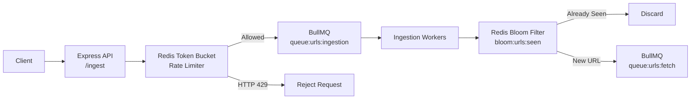
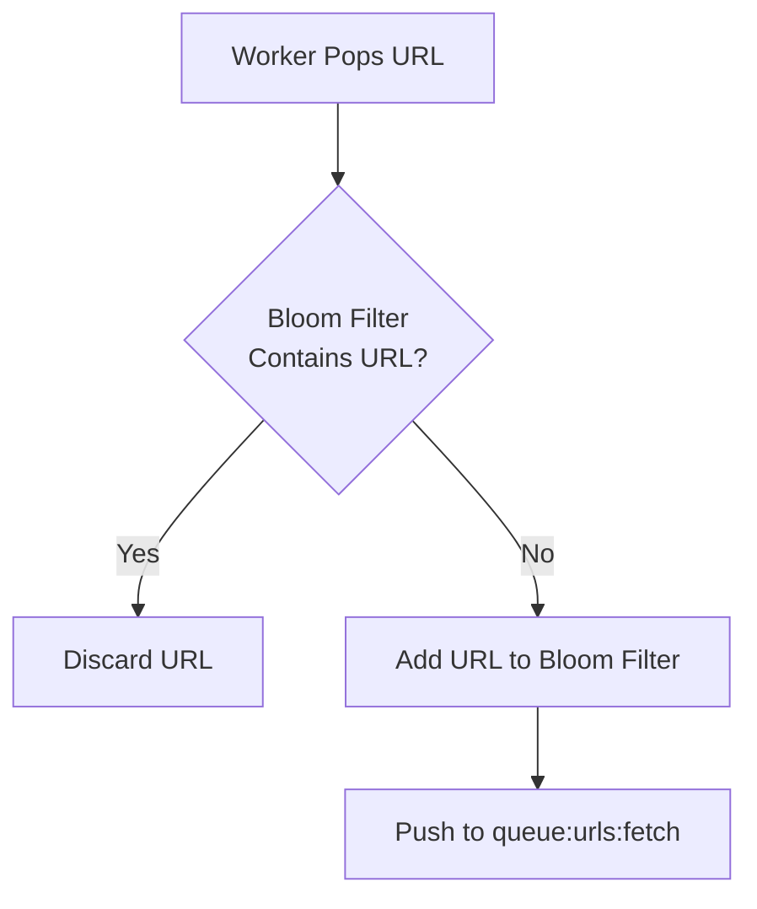

# 02. URL Ingestion
The URL Ingestion layer is responsible for accepting newly discovered URLs and feeding them into the crawler pipeline as quickly as possible.

One of the main goals of this component was to make sure that sudden traffic spikes don't affect the responsiveness of the API. During testing, the ingestion service was able to handle bursts exceeding **14,000 Requests Per Second** without causing event-loop starvation.

---

## Overall Flow



---

## Request Flow

Every incoming request first reaches the `/ingest` endpoint exposed by the Express API. Before any processing happens, the request passes through a Redis-backed **Token Bucket** rate limiter implemented using **rate-limiter-flexible**.

This acts as the first line of defense against abusive traffic. If a client exceeds the configured request limit, the request is rejected immediately with:

```text
HTTP 429 - Too Many Requests
```

This prevents unnecessary work from entering the crawler pipeline.

---

## Immediate Decoupling

Once a request passes the rate limiter, the API does not perform any validation, deduplication, or database operations synchronously. Instead, the URL is immediately pushed into the `queue:urls:ingestion` BullMQ queue.

As soon as the enqueue operation succeeds, the API responds with:
```text
HTTP 202 Accepted
```

The client connection is typically closed in under **15 ms**, without waiting for downstream processing. This keeps request latency low even when the crawler is under heavy load, since all expensive work happens asynchronously.

---

## Seen-Set Deduplication
Dedicated ingestion workers continuously consume jobs from `queue:urls:ingestion`. These workers run with high concurrency (for example, **100 concurrent jobs**) because the work they perform is lightweight and mostly consists of Redis operations. For every URL, the worker performs an **O(1)** membership check against the Redis Bloom Filter:

```text
bloom:urls:seen
```

The processing logic is straightforward.

**If the URL has already been seen:**
- The URL is discarded.
- Nothing is forwarded downstream.

**If the URL has not been seen:**
- The URL is added to the Bloom Filter.
- It is marked as discovered.
- It is pushed into the `queue:urls:fetch` queue, where it becomes available for crawler workers.

---

## Deduplication Logic


---

## Why a Bloom Filter?
Storing every discovered URL in a traditional database or Redis Set would cause memory usage to grow linearly as the crawler discovers more pages. Instead, DevSearch uses a **Redis Bloom Filter**, which provides probabilistic membership checks while consuming a predictable amount of memory.

Memory usage stays approximately constant at around:

```text
~12 KB per 10,000 URLs
```

This makes the ingestion layer much more memory efficient and protects the system from running out of memory during large crawl sessions. The trade-off is the possibility of a very small false-positive rate, which is acceptable for a large-scale web crawler where avoiding duplicate work is generally more valuable than crawling every possible URL.