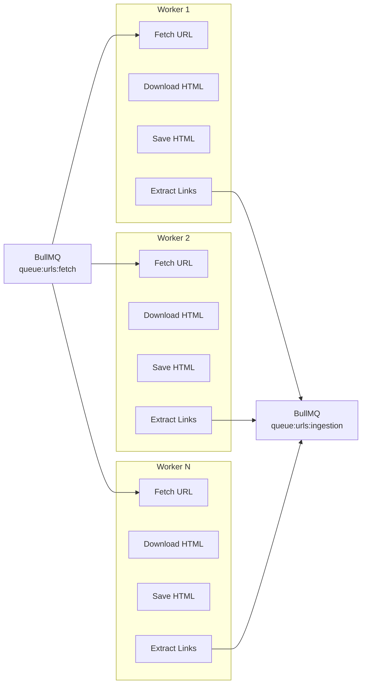
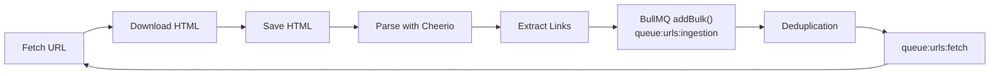

# 03. Distributed Workers
The worker layer is responsible for downloading web pages, extracting new links, and storing the raw HTML.

Since crawling is primarily network-bound, the workers are designed to process multiple requests concurrently while also being able to scale horizontally across multiple CPU cores. Rather than relying on a single large Node.js process, the crawler runs multiple independent worker processes. This removes the single-process bottleneck and allows the system to continue scaling as more CPU cores become available.

---

## Worker Architecture



---

## Concurrency vs Horizontal Scaling
Each worker runs with a small amount of local concurrency (for example, **5 concurrent jobs**). This allows a single Node.js process to keep multiple network requests in flight without blocking the event loop. However, local concurrency alone is not enough to fully utilize modern multi-core machines.

To achieve true scaling, multiple worker processes are started. Each process has its own event loop and memory space, allowing work to be distributed across multiple CPU cores instead of competing within a single Node.js process.

---

## Process Isolation

Workers are deployed as independent operating system processes using either **Docker Compose replicas** or **PM2**. Since each worker has its own process ID (PID), the operating system scheduler can distribute them across the available CPU cores. For workloads that involve heavier CPU usage, such as HTML parsing or text processing, CPU affinity can also be configured.

For example:

```text
Express API      -> CPU 0
Crawler Workers  -> CPU 1-3
```

This prevents expensive parsing operations from competing with the API server for CPU time, helping keep request latency low even while the crawler is busy.

---

## Browser-like Requests

Some websites block requests that appear to come from automated clients. To reduce these failures, the crawler uses a custom browser-grade `https.Agent`. The agent mimics a modern Google Chrome TLS handshake by negotiating standard JA3 cipher suites and TLS 1.3 profiles.

This makes outbound requests look much closer to those generated by a real browser and helps avoid HTTP **403 Forbidden** responses from anti-bot CDNs.

---

## HTML Storage

After a page is successfully downloaded, the raw HTML is written directly to disk. Instead of storing every file in a single directory, DevSearch uses a deterministic sharding strategy based on the URL's SHA-256 hash.

For example:

```text
SHA-256

a4f8d9b13...
```

is stored as

```text
./data/html/a4/f8/a4f8d9b13....html
```

By splitting files across nested directories, the filesystem avoids large flat folders containing millions of files. This keeps directory lookups efficient even as the crawler grows.

---

## Closed-Loop Crawling

After storing the HTML, the worker parses the document using **Cheerio**. Every outbound link is extracted, normalized, and collected. Instead of pushing URLs one by one, the worker inserts them back into the ingestion pipeline using BullMQ's `addBulk()` API. This completes the crawling loop.

Newly discovered URLs are sent back through the ingestion layer, where they are deduplicated before eventually reaching the fetch queue again.



This self-feeding pipeline allows the crawler to continuously discover and process new pages while keeping every stage loosely coupled and independently scalable.