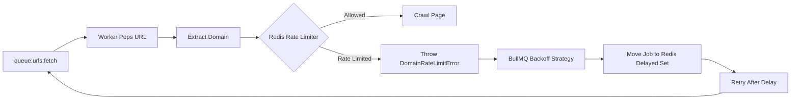
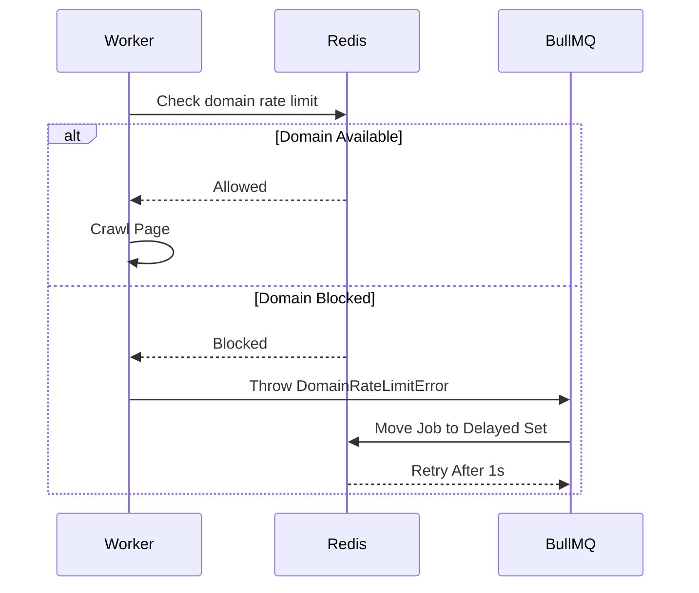

# 04. Rate Limiting
When running a distributed crawler, rate limiting cannot be handled using in-memory timers.

Each crawler worker runs as an independent process, so keeping rate-limiting state locally would allow multiple workers to unknowingly send requests to the same domain at the same time.

To avoid this, DevSearch uses a globally shared Redis-backed rate-limiting mechanism. Every worker consults the same source of truth before making a request, ensuring that domain politeness is maintained across the entire crawler cluster.

---

## Overall Flow



---

## Distributed Rate Limiting

Before downloading a page, every worker checks whether the target domain is currently allowed to receive another request. The decision is made using a Redis-backed rate limiter:

```text
ratelimit:domain:<hostname>
```

Since every worker communicates with the same Redis instance, the rate limit is enforced globally instead of per process. For example, a policy like:

```text
5 requests / second / domain
```

is respected even if dozens of crawler workers are running simultaneously. This prevents the crawler from accidentally flooding a website as it scales horizontally.

---

## Avoiding the "Sleep" Anti-Pattern

A common implementation is to simply make the worker sleep whenever a rate-limited domain is encountered.

For example:

```javascript
await sleep(1000);
```

Although simple, this approach wastes worker capacity. While the worker is sleeping, it cannot process URLs belonging to completely different domains that are ready to be crawled. As more workers spend time waiting, the crawler gradually loses throughput even though there is useful work available.

---

## Non-Blocking Backoff

Instead of sleeping, the worker immediately throws a custom:

```text
DomainRateLimitError
```

The worker does not wait for the rate limit to expire. Instead, BullMQ catches the exception and routes it through a custom `domainRateLimit` backoff strategy.

The job is then moved back into BullMQ's delayed queue with the appropriate delay.This entire operation is performed atomically inside Redis.

---

## Delayed Job Lifecycle



---

## Immediate Worker Release

As soon as the delayed job is written back to Redis, the worker becomes free again. Instead of waiting for the blocked domain to become available, it immediately starts processing another URL from a different domain.This keeps every worker busy performing useful work rather than waiting on timers.

As the crawler scales to more workers, this approach allows the entire cluster to remain highly utilized while still respecting the politeness policies of every website being crawled.