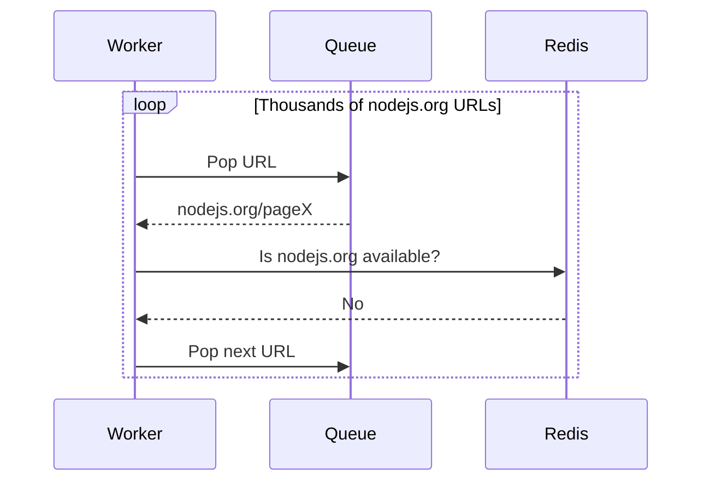

# Queue Poisoning due to Per-URL Scheduling

## Background

The crawler follows a distributed architecture where multiple crawler workers consume URLs from a global fetch queue. To make sure we don't overload a website, a politeness policy is implemented using a Redis sorted set. Whenever a worker successfully crawls a page, that domain is inserted into the Redis sorted set with a score of:

```text
current_timestamp + crawl_delay
```

For example: if the crawl delay is **1 second**, the same domain cannot be crawled again until one second has passed.

Before crawling any URL, the worker simply checks whether that domain is currently rate limited. This works well for preventing too many requests to the same website.

---

## Observed Issue

The problem starts when crawling websites that expose a very large number of internal links.
For example: crawling the homepage of `nodejs.org` may discover thousands of internal URLs. Since link extraction is much faster than the configured crawl delay, all of these URLs get pushed into the global fetch queue almost immediately.

At the same time, because the homepage was just crawled, `nodejs.org` is already present in the rate-limited set. Now every crawler worker starts picking URLs from the queue. Each worker does something like this:
1. Pop a URL from the global fetch queue.
2. Extract the domain.
3. Check Redis to see whether the domain is available.
4. If the domain is still rate limited, discard the URL and immediately pop another one.

Nothing is technically wrong here. The politeness policy is doing exactly what it should.

The issue is that workers keep repeating the same checks for thousands of URLs that all belong to the same blocked domain.

---

## Example

Suppose the global fetch queue looks like this.

```text
[
    nodejs.org/page1
    nodejs.org/page2
    nodejs.org/page3
    ...
    nodejs.org/page3500
    github.com/page1
    redis.io/page1
]
```

Immediately after crawling `nodejs.org/page1`:

```text
Rate Limited Domains

nodejs.org -> available at T + 1 second
```

For the next one second, workers continuously pop URLs from `nodejs.org`. Every single one follows the exact same path.



No HTTP request is actually made.The worker simply keeps spending time discovering that the domain is still blocked.

---

## Why this becomes a problem

The crawler is still respecting crawl delay, so correctness isn't affected. The problem is the amount of unnecessary work happening during that one second. Every skipped URL still requires:
- Queue pop
- Domain extraction
- Redis lookup
- Worker CPU time

When there are only a few skipped URLs, this overhead is negligible. When there are thousands of URLs from the same domain, every worker ends up doing the same repeated work over and over again. Instead of crawling pages from other domains that are ready, workers spend most of their time proving that `nodejs.org` still cannot be crawled.

---

## Root Cause

Initially it looks like the rate limiter is the bottleneck.

It actually isn't. The rate limiter is working exactly as expected. The real issue comes from the scheduling strategy.

Today, scheduling happens at the **URL level**. Workers first retrieve an individual URL, then check whether its domain is allowed to crawl. That means if there are 3,500 URLs from the same blocked domain, all 3,500 URLs are examined independently even though they all produce the same answer. The scheduler is repeatedly asking:
> Can I crawl this URL?

when the better question would be:
> Which domain is eligible to crawl next?

That difference is what creates the unnecessary work.

---

## Impact

This design causes a few noticeable problems.
- Large domains can dominate the global fetch queue.
- Workers waste CPU cycles processing URLs that cannot be crawled yet.
- Thousands of unnecessary Redis lookups are performed.
- Smaller domains may wait longer even though they are ready to be crawled.
- Overall crawler throughput decreases even when workers are idle enough to crawl other websites.